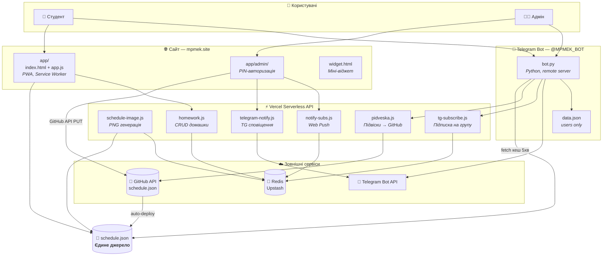
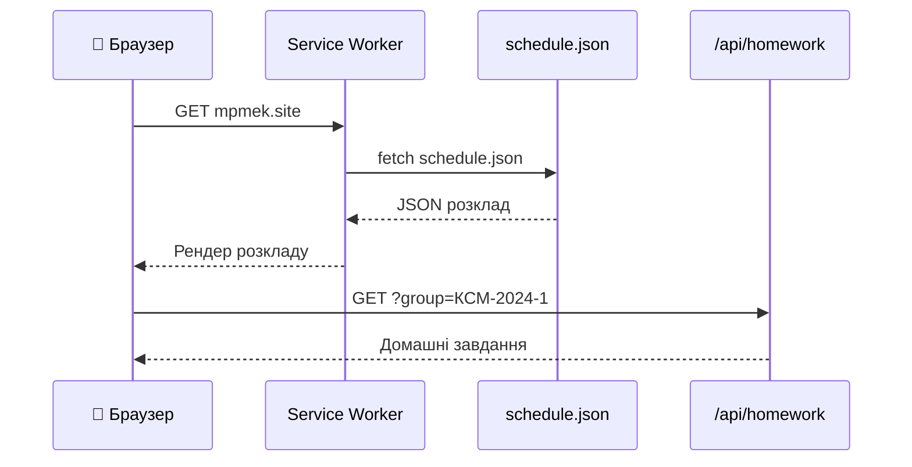
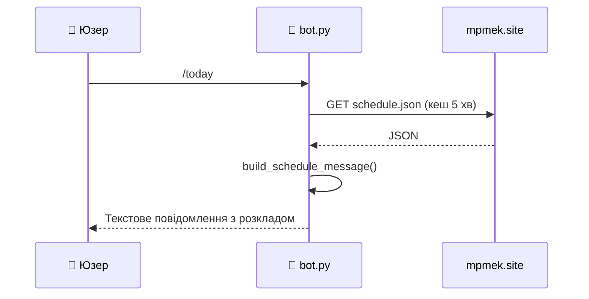
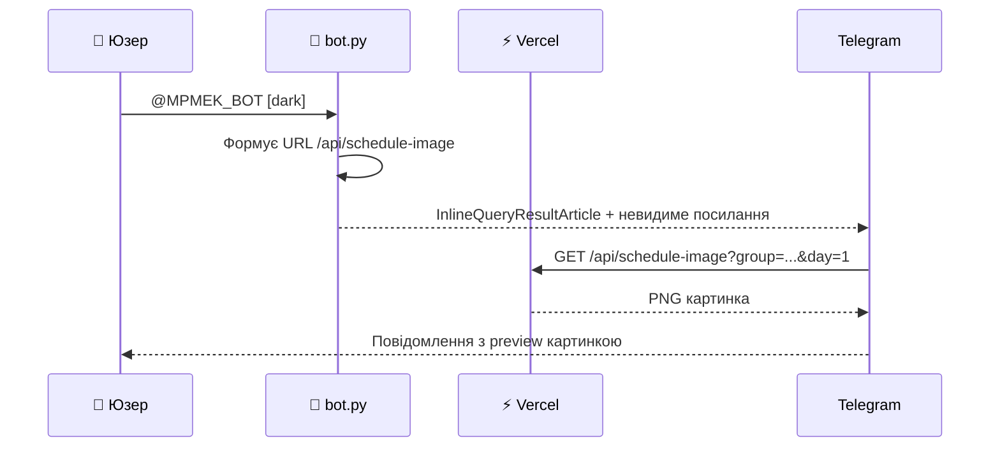
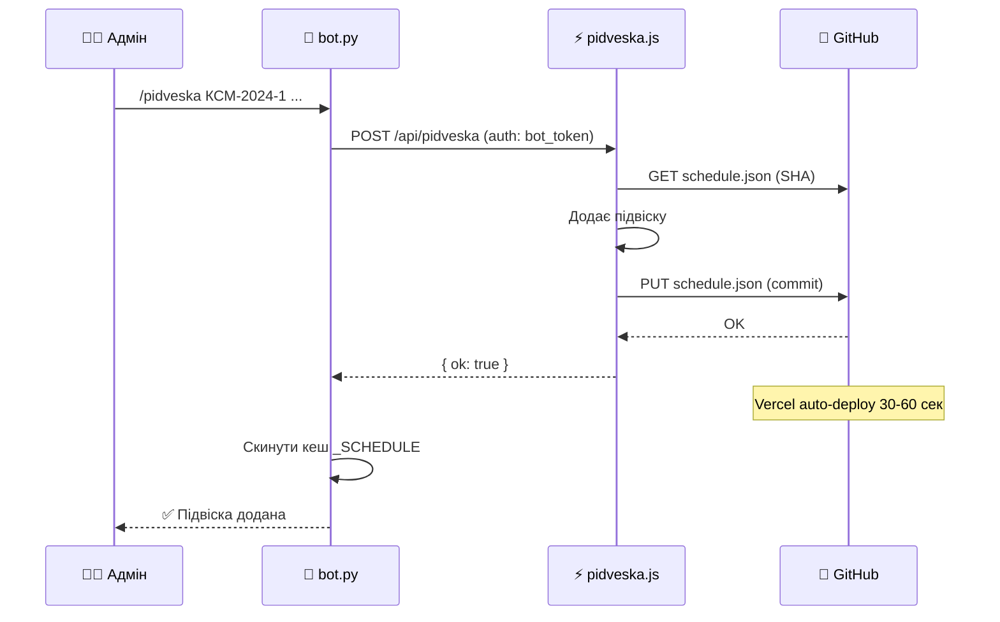
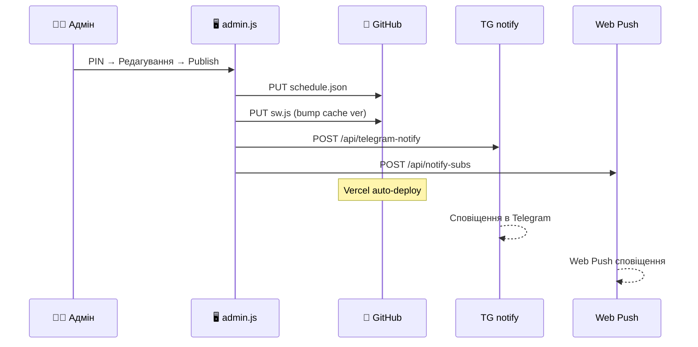

# 📚 Розклад Студента — Архітектура системи

> [!info] Проект
> **mpmek.site** — веб-додаток + Telegram-бот для перегляду розкладу коледжу МПМЕК.
> Два репозиторії, єдине джерело даних — `schedule.json`.

---

## 🏗 Загальна архітектура



---

## 📁 Файлова структура

> [!abstract] Веб-додаток — `nazarn1xyy/mpmek`

| Файл | Опис |
|------|------|
| `app/index.html` | Головна сторінка PWA |
| `app/app.js` | SPA логіка: розклад, ДЗ, сповіщення, навігація |
| `app/style.css` | Стилі додатку |
| `app/sw.js` | Service Worker — кеш, push-нотифікації |
| `app/schedule.json` | 📌 **Єдине джерело розкладу для всіх** |
| `app/manifest.json` | PWA маніфест |
| `app/widget.html` | Міні-віджет розкладу |
| `app/admin/index.html` | Адмін-панель (PIN-авторизація) |
| `app/admin/admin.js` | Редагування розкладу, публікація через GitHub API |
| `api/_lib/redis.js` | Обгортка Upstash Redis REST API |
| `api/schedule-image.js` | Генерація PNG розкладу (`@napi-rs/canvas`) |
| `api/homework.js` | CRUD домашніх завдань (Redis) |
| `api/pidveska.js` | Додавання/видалення підвісок через GitHub API |
| `api/telegram.js` | Webhook бота (inline-режим на Vercel) |
| `api/telegram-notify.js` | TG-сповіщення про заміни |
| `api/tg-subscribe.js` | Підписка TG-юзерів на групу |
| `api/subscribe.js` | Web Push підписка |
| `api/unsubscribe.js` | Web Push відписка |
| `api/notify-subs.js` | Надсилання Web Push |
| `api/admin-config.js` | GitHub-налаштування (Redis) |
| `api/cron/daily-notify.js` | Щоденне cron-сповіщення |

> [!abstract] Telegram-бот — окремий сервер

| Файл | Опис |
|------|------|
| `bot.py` | Монолітний скрипт бота (~2100 рядків) |
| `data.json` | Дані користувачів (групи, час сповіщень) |
| `OOBJECT.py` | Словник груп → список предметів |

---

## 📄 Формат schedule.json

```json
{
  "КСМ-2024-1": {
    "ОСНОВНИЙ РОЗКЛАД": {
      "Понеділок": [
        { "number": 1, "subject": "Математика", "teacher": "Шмундяк О.В.", "room": "42" }
      ]
    },
    "ЧИСЕЛЬНИК": { "Понеділок": [ ... ] },
    "ЗНАМЕННИК": { "Вівторок": [ ... ] },
    "ПІДВІСКА": [
      { "date": "14.04", "number": 2, "subject": "Фізика", "teacher": "Фельчин Б.М." }
    ]
  }
}
```

> [!tip] Тип тижня
> **ЧИСЕЛЬНИК** — непарний тиждень, **ЗНАМЕННИК** — парний. **ОСНОВНИЙ РОЗКЛАД** — пари які є завжди.
> **ПІДВІСКА** — одноразові заміни на конкретну дату.

---

## 🔄 Потоки даних

### 1️⃣ Студент відкриває сайт



### 2️⃣ Студент пише боту `/today`



### 3️⃣ Інлайн-режим `@MPMEK_BOT`



### 4️⃣ Адмін додає підвіску (бот)



### 5️⃣ Адмін публікує з веб-панелі



---

## 🛠 Стек технологій

| Компонент | Технологія |
|:----------|:-----------|
| 🌐 **Сайт** | Vanilla JS, CSS, HTML (PWA) |
| ☁️ **Хостинг** | Vercel (serverless functions) |
| 🤖 **Бот** | Python, python-telegram-bot v20+, apscheduler |
| 🔴 **БД** | Upstash Redis (REST API) |
| 🖼 **Картинки** | @napi-rs/canvas (Node.js) |
| 🔔 **Push** | web-push (VAPID) |
| 📄 **Розклад** | GitHub repo → schedule.json |
| 🚀 **CI/CD** | Vercel auto-deploy on git push |

---

## 🔑 Env-змінні (Vercel)

> [!warning] Не коммітити в репо!

| Змінна | Опис |
|:-------|:-----|
| `TELEGRAM_BOT_TOKEN` | Токен Telegram-бота |
| `GITHUB_TOKEN` | GitHub PAT (repo scope) |
| `GITHUB_OWNER` | Власник репо |
| `GITHUB_REPO` | Назва репо |
| `KV_REST_API_URL` | Upstash Redis REST URL |
| `KV_REST_API_TOKEN` | Upstash Redis REST Token |
| `VAPID_PUBLIC_KEY` | Web Push public key |
| `VAPID_PRIVATE_KEY` | Web Push private key |
| `VAPID_SUBJECT` | mailto: контакт |
| `ADMIN_PIN` | 4-значний PIN адмін-панелі |

---

## 🔴 Redis-ключі

| Ключ | Тип | Опис |
|:-----|:----|:-----|
| `hw:{group}` | HASH | Домашні завдання. Поле: `{день}:{номер}` → текст |
| `push-subs` | HASH | Web Push підписки. Поле: `sha256(endpoint)` → JSON |
| `tg_subs:{group}` | SET | Telegram `chat_id` підписників групи |
| `admin-config` | STRING | JSON з GitHub налаштуваннями |

---

> [!quote] Автор
> Розробив **Назар Шикір** — МПМЕК, 2024-2026
